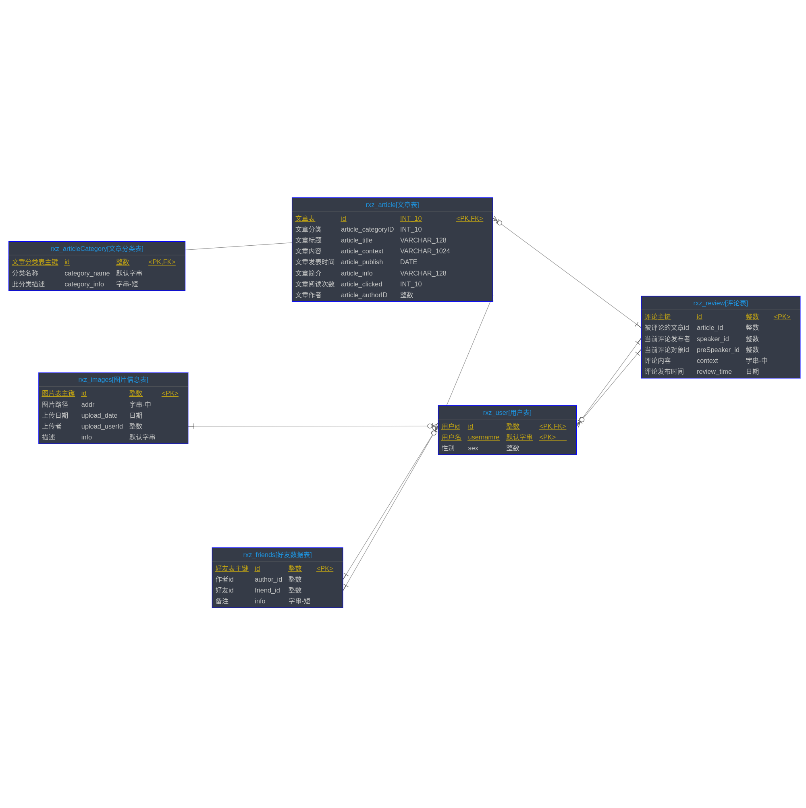

## 
目录

 - ### 1. 模块清单
- [<h4 id="module-blog_database_design-from">1.1. 博客数据库表设计</h4>](#module-blog_database_design "blog_database_design")
	- [<h5 id="module-blog_database_design-relation}-from">1.1.1. 关联关系</h5>](#module-blog_database_design-relation "关联关系")
	- [<h5 id="module-blog_database_design-tableList-from">1.1.2. 表清单</h5>](#module-blog_database_design-tableList "表清单")
	- [<h5 id="module-blog_database_design-tableColumnList-from">1.1.3. 表列清单</h5>](#module-blog_database_design-tableColumnList "表列清单")
		- [<h6 id="module-blog_database_design-tableColumnList-rxz_article-from">1.1.3.1 rxz\_article【文章表】</h6>](#module-blog_database_design-tableColumnList-rxz_article "rxz_article")
		- [<h6 id="module-blog_database_design-tableColumnList-rxz_articleCategory-from">1.1.3.2 rxz\_articleCategory【文章分类表】</h6>](#module-blog_database_design-tableColumnList-rxz_articleCategory "rxz_articleCategory")
		- [<h6 id="module-blog_database_design-tableColumnList-rxz_friends-from">1.1.3.3 rxz\_friends【好友数据表】</h6>](#module-blog_database_design-tableColumnList-rxz_friends "rxz_friends")
		- [<h6 id="module-blog_database_design-tableColumnList-rxz_images-from">1.1.3.4 rxz\_images【图片信息表】</h6>](#module-blog_database_design-tableColumnList-rxz_images "rxz_images")
		- [<h6 id="module-blog_database_design-tableColumnList-rxz_user-from">1.1.3.5 rxz\_user【用户表】</h6>](#module-blog_database_design-tableColumnList-rxz_user "rxz_user")
		- [<h6 id="module-blog_database_design-tableColumnList-rxz_review-from">1.1.3.6 rxz\_review【评论表】</h6>](#module-blog_database_design-tableColumnList-rxz_review "rxz_review")
  ---

### 1. 模块清单
 - [<h4 id="module-blog_database_design">1.1. 博客数据库表设计</h4>](#module-blog_database_design-from)
 - [<h5 id="module-blog_database_design-relation">1.1.1 关联关系</h5>](#module-blog_database_design-relation-from)
 ---

 ---

 - [<h5 id="module-blog_database_design-tableList">1.1.2 表清单</h5>](#module-blog_database_design-tableList-from)

 ---

| 名称 | 代码 | 备注 |
| ------------ | ------------ | ------------ |
| 文章表 | rxz\_article |  |
| 文章分类表 | rxz\_articleCategory |  |
| 好友数据表 | rxz\_friends |  |
| 图片信息表 | rxz\_images |  |
| 用户表 | rxz\_user |  |
| 评论表 | rxz\_review |  |

 ---

 - [<h5 id="module-blog_database_design-tableColumnList">1.1.3 表列清单</h5>](#module-blog_database_design-tableColumnList-from)

 ---

 - [<h6 id="module-blog_database_design-tableColumnList-rxz_article">rxz_article【文章表】</h6>](#module-blog_database_design-tableColumnList-rxz_article-from)

| 代码 | 名称 | 数据类型(MYSQL) | 主键 | 备注 |
| ------------ | ------------ | ------------ | ------------ | ------------ |
| id | 文章表 | INT(10) | √ |  |
| article\_categoryID | 文章分类 | INT(10) |  |  |
| article\_title | 文章标题 | VARCHAR(128) |  |  |
| article\_context | 文章内容 | VARCHAR(1024) |  |  |
| article\_publish | 文章发表时间 | DATE |  |  |
| article\_info | 文章简介 | VARCHAR(128) |  |  |
| article\_clicked | 文章阅读次数 | INT(10) |  |  |
| article\_authorID | 文章作者 | INT |  |  |

 ---

 - [<h6 id="module-blog_database_design-tableColumnList-rxz_articleCategory">rxz_articleCategory【文章分类表】</h6>](#module-blog_database_design-tableColumnList-rxz_articleCategory-from)

| 代码 | 名称 | 数据类型(MYSQL) | 主键 | 备注 |
| ------------ | ------------ | ------------ | ------------ | ------------ |
| id | 文章分类表主键 | INT | √ |  |
| category\_name | 分类名称 | VARCHAR(32) |  |  |
| category\_info | 此分类描述 | VARCHAR(128) |  |  |

 ---

 - [<h6 id="module-blog_database_design-tableColumnList-rxz_friends">rxz_friends【好友数据表】</h6>](#module-blog_database_design-tableColumnList-rxz_friends-from)

| 代码 | 名称 | 数据类型(MYSQL) | 主键 | 备注 |
| ------------ | ------------ | ------------ | ------------ | ------------ |
| id | 好友表主键 | INT | √ |  |
| author\_id | 作者id | INT |  |  |
| friend\_id | 好友id | INT |  |  |
| info | 备注 | VARCHAR(128) |  |  |

 ---

 - [<h6 id="module-blog_database_design-tableColumnList-rxz_images">rxz_images【图片信息表】</h6>](#module-blog_database_design-tableColumnList-rxz_images-from)

| 代码 | 名称 | 数据类型(MYSQL) | 主键 | 备注 |
| ------------ | ------------ | ------------ | ------------ | ------------ |
| id | 图片表主键 | INT | √ |  |
| addr | 图片路径 | VARCHAR(1024) |  |  |
| upload\_date | 上传日期 | DATE |  |  |
| upload\_userId | 上传者 | INT |  |  |
| info | 描述 | VARCHAR(32) |  |  |

 ---

 - [<h6 id="module-blog_database_design-tableColumnList-rxz_user">rxz_user【用户表】</h6>](#module-blog_database_design-tableColumnList-rxz_user-from)

| 代码 | 名称 | 数据类型(MYSQL) | 主键 | 备注 |
| ------------ | ------------ | ------------ | ------------ | ------------ |
| id | 用户id | INT | √ |  |
| usernamre | 用户名 | VARCHAR(32) | √ |  |
| sex | 性别 | INT |  |  |

 ---

 - [<h6 id="module-blog_database_design-tableColumnList-rxz_review">rxz_review【评论表】</h6>](#module-blog_database_design-tableColumnList-rxz_review-from)

| 代码 | 名称 | 数据类型(MYSQL) | 主键 | 备注 |
| ------------ | ------------ | ------------ | ------------ | ------------ |
| id | 评论主键 | INT | √ |  |
| article\_id | 被评论的文章id | INT |  |  |
| speaker\_id | 当前评论发布者 | INT |  |  |
| preSpeaker\_id | 当前评论对象id | INT |  |  |
| context | 评论内容 | VARCHAR(1024) |  |  |
| review\_time | 评论发布时间 | DATE |  |  |

 ---

